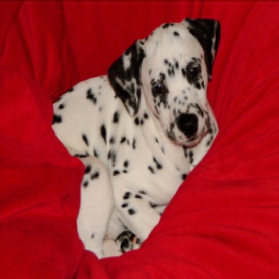
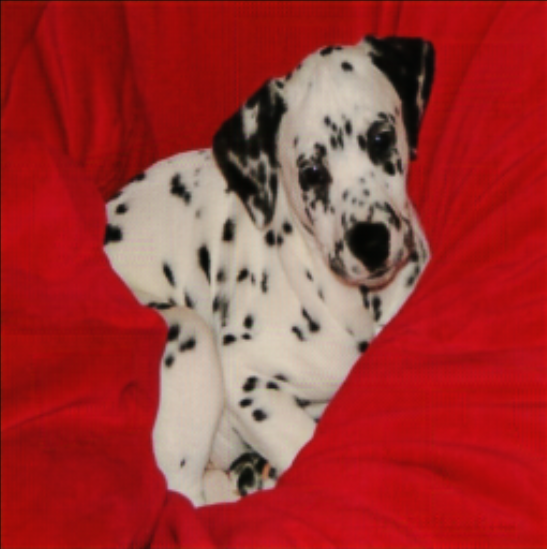
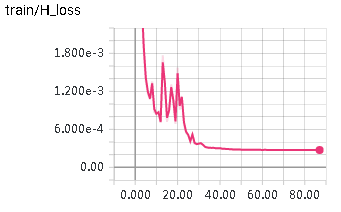
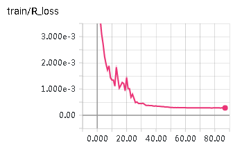

# pytorch-Deep-Steganography


## Introduction
This is a pytorch Implementation of image steganography using deep convolutional neural networks ,which is similar to the paper: "[Hiding Images in Plain Sight: Deep Steganography](https://papers.nips.cc/paper/6802-hiding-images-in-plain-sight-deep-steganography) ".But our result is significantly outperforms the [unofficial implementation by harveyslash](https://github.com/harveyslash/Deep-Steganography) 

[Image Steganography](https://en.wikipedia.org/wiki/Steganography) is the science of Hiding a message in another message. In this case, a Picture is hidden inside another picture using Deep convolutional neural networks.

More detail information can be found in my [Blog](http://ssss)

## Dependencies & Installation & Usage
You need to clone or download this repository first, Then the dependencies can be installed by using 
```bash
pip install -r requirements.txt
```
---
If you just want to inference the model, you can type like this:
```bash
# because the filesize is limited to 100MB, so the model is separated into 2 file netH.tar.gz.1 and netH.tar.gz.2 in the checkPoint folder
cat ./checkPoint/netH.tar.gz* | tar -xzv -C ./checkPoint/
CUDA_VISIBLE_DEVICES=0 python main.py --test=./example_pics
```
You can also use your own image folder to replace the example_pics, just need to provide the correct path.

----

Otherwise if you need to train the model on your own dataset, you need to change the <font color=blue size=5>DATA_DIR</font> path in the main.py, which is in the 35th line, both train and validation dataset need to be put into the folder.
```python
35 DATA_DIR = '/n/liyz/data/deep-steganography-dataset/'
```
And then type like this:
```python
CUDA_VISIBLE_DEVICES=0 python main.py 
```


#### This task requires a lot of computing resources, our model is trained in 45000 iamges from ImageNet, and evaluated on 5000 pics. All images are resized to 256*256 without normalization. And this take us nearly 24 hours on one nvidia GTX 1080 ti.


## Framework & Results
The Framework takes in Two images. One is the cover image(the 1st row) and another is the secret image(the 3nd row) . 

The goal is to 'hide' the secret image in the cover image Through a Hiding net such that only the cover image is visible. This is called container image(the 2nd row)

Then , this hidden image can be passed to a Revealing network, which can get the hidden image back, and this is called rev_secret img(the 4th row).
### Result Picture


As you can see, it is visually very hard to find the difference between the cover image and the contianer image. Yet the Reveal network can get back the information of the secret image only with tiny deviation. (If you can not notice the tiny deviation, you can download the picture to zoom in)

### Tiny Deviations 
* deviation between cover and contianer 
<table align='center'>
<tr align='center'>
<td> cover image </td>
<td> container image </td>
</tr>
<tr>
<td>
<td>
</tr>
</table>


* deviation between secret and revealed secret 
<table align='center'>
<tr align='center'>
<td> secret image </td>
<td> revealed secret image </td>
</tr>
<tr>
<td>
<td>
</tr>
</table>
  


### Network Architecture 
- Unlike the [[1]](https://papers.nips.cc/paper/6802-hiding-images-in-plain-sight-deep-steganography), we just used two nets to get the result, one Hiding net and one Revealing net.
- For the Hiding net, an Unet structred convolutional network was used to achive this goal. Cover image and secret image are concatenated into a 6 channels tensor as the input of the Hiding net.
- For Revealing net, there are 6 conv layers with 3*3 kernel size, and each layer is followed by a BN and ReLU except the last one. Contianer img produced by the Hiding net is used as the input of the Revealing net directly.
- For more details of the network architecture, you can just read the source code which is in the models folder

### Loss Curves & Averaged pixel-wise discrepancy (APD) 
Two networks were trained with beta values 0.75), batch size of 32(16 covers and 16 secrets). The loss curves are shown below:
* Loss curves on Hiding net and Revealing net 
<table align='center'>
<tr align='center'>
<td> MSE loss on cover and contianer </td>
<td> MSE loss on secret and revealed secret</td>
</tr>
<tr>
<td>
<td>
</tr>
</table>

* Averaged pixel-wise discrepancy

Dataset| contianer - cover(APD)    (0-255)| secret - rev_secret(APD)     (0-255)|
----|----------------| --------------------|
training| 4.20 |4.73 |
validation|4.16 |4.40 |

## Reference: 

[1] Baluja S. Hiding Images in Plain Sight: Deep Steganography[C]//Advances in Neural Information Processing Systems. 2017: 2066-2076.

## Acknowledgement
Thanks for the help of [@arnoweng](https://github.com/arnoweng) during this project. At the same time, I am very grateful to [Prof.Yadong Mu](http://www.muyadong.com) for his guidance. 
